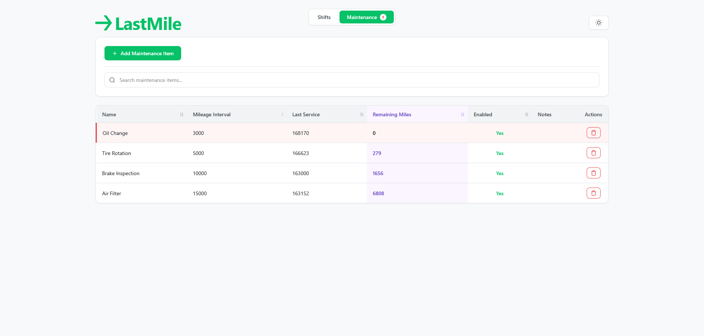
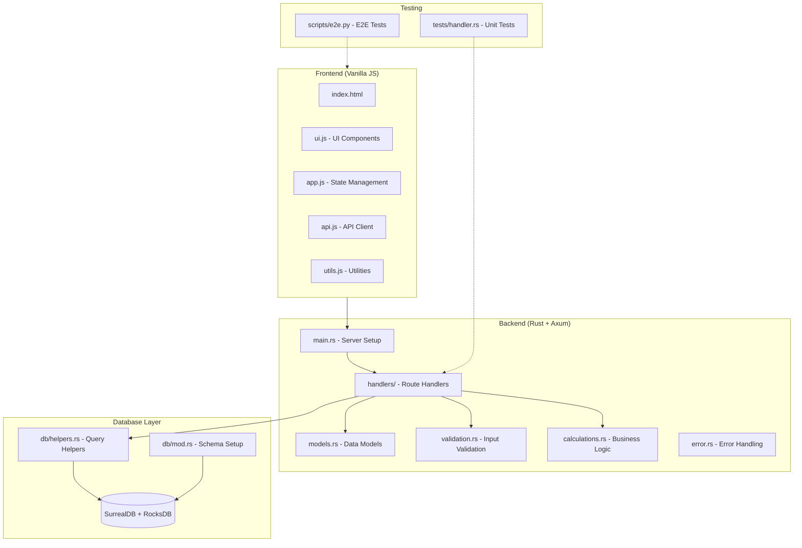

# LastMile

[](https://github.com/dylan-park/LastMile/actions/workflows/ci.yml) [](https://www.rust-lang.org/) [](https://surrealdb.com/) [](LICENSE-MIT) [](LICENSE-APACHE)

A self-hosted web application for independent delivery couriers to track shifts, earnings, and vehicle maintenance. Built with Rust and SurrealDB, LastMile helps drivers stay on top of their finances and vehicle health without relying on third-party services or tedious spreadsheets.

## Motivation

LastMile was born out of necessity. When circumstances led me to food delivery work to make ends meet, I found myself struggling with the same problems many gig workers face: tracking earnings, hours, and vehicle maintenance across shifts was time-consuming and cumbersome. Most solutions either cost money I didn't want to spend, compromised privacy, or simply didn't fit the flexible nature of delivery work. As a developer, I had the skills to build something that worked better for me, so I did. LastMile is a self-hosted, privacy-focused tool that gives drivers complete control over their data, with no subscriptions or third-party dependencies, and it provides confidence come tax season you have work data you can trust.

## Features

- **Shift Management** - Track start/end times, odometer readings, earnings, tips, and gas costs
- **Real-time Statistics** - View earnings, hours worked, average hourly rate, and total miles driven
- **Flexible Filtering** - Filter shifts by month, all time, or custom date ranges
- **Maintenance Tracking** - Set up mileage-based maintenance reminders for oil changes, tire rotations, and more
- **Inline Editing** - Click any field in the table to edit shift details on the fly
- **CSV Export** - Export shift data with automatic filtering based on your current view (month, all time, or custom range) for external analysis or tax preparation
- **Dark Mode** - Easy on the eyes during late-night shifts
- **Fully Self-Hosted** - Your data stays on your machine, no cloud required
- **Responsive Design** - Works on desktop and mobile devices

## Screenshots

### Shifts View


### Maintenance Tracking


## Quick Start

### Prerequisites

- [Rust](https://rustup.rs/) 1.88 or higher
- Modern web browser (Chrome, Firefox, Safari, Edge)

### Local Development

1. Clone the repository:
   ```bash
   git clone https://github.com/dylan-park/LastMile.git
   cd lastmile
   ```

2. Run the application:
   ```bash
   cargo run --release
   ```

3. Open your browser to [http://localhost:3000](http://localhost:3000)

The database will be created automatically in the `./data` directory.

### Docker

Build and run with Docker:

```bash
docker build -t lastmile .
docker run -d \
  --name lastmile \
  --hostname lastmile \
  --restart unless-stopped \
  -p 3000:3000 \
  -v ./data:/app/data \
  -v ./static:/app/static:ro \
  -e DATABASE_PATH=/app/data \
  -e PORT=3000 \
  -e TZ=America/Chicago \
  -e RUST_LOG=info \
  lastmile
```

Access the application at [http://localhost:3000](http://localhost:3000)

### Docker Compose

For the easiest deployment:

```bash
docker-compose up -d
```

The application will be available at [http://localhost:3000](http://localhost:3000) with persistent data storage.

See [docker-compose.yaml](docker-compose.yaml) for configuration options.

## Configuration

Environment variables (all optional):

| Variable | Description | Default |
|----------|-------------|---------|
| `DATABASE_PATH` | Database storage location | `./data` |
| `PORT` | Application port | `3000` |
| `TZ` | Timezone for logs | `America/Chicago` |
| `RUST_LOG` | Log level (`error`, `warn`, `info`, `debug`, `trace`) | `info` |

### CLI Flags

- `--e2e`: Enables the `/api/test/teardown` endpoint. **Only use this for e2e testing.**
- `--demo`: Runs LastMile in [Demo Mode](#demo-mode)

## Demo Mode

You can run the application in demo mode with:
```bash
cargo run --release -- --demo
```
When enabled, demo mode changes the application behavior in the following ways:
- Uses an in-memory database instead of disk storage
- Creates isolated sessions per browser session
- Generates random sample data
- Automatically clears sessions that have been idle for more than 1 hour (checked hourly)

Demo mode is intended for showcasing the features of LastMile before committing to a full setup. All functionality is available except for persistent data storage.

## Database Backup

If you have SurrealDB CLI installed, you can backup your database:

```bash
surreal export --endpoint file://./data --namespace lastmile --database main export.surql
```

## Architecture Layers



## Technology Stack

- **Backend**: Rust with [Axum](https://github.com/tokio-rs/axum) web framework
- **Database**: [SurrealDB](https://surrealdb.com/) with embedded RocksDB backend
- **Frontend**: Vanilla JavaScript, HTML5, CSS3 (no frameworks)

## Contributing

Contributions are welcome! Here's how you can help:

1. **Fork the repository** and create a new branch for your feature or bugfix
2. **Write tests** for your changes (unit tests in their related modules, integration tests in `tests/`, E2E tests in `scripts/e2e.py`)
3. **Follow the existing code style**:
   - Rust: Use `cargo fmt` and `cargo clippy`
   - JavaScript: 2-space indentation, double quotes
4. **Submit a pull request** with a clear description of your changes

### Running Tests

**Unit/Integration Tests:**
```bash
cargo test
```

**E2E Tests** (requires Selenium Grid on port 4444):
```bash
# Optionally run in a venv
pip install -r requirements.txt
pytest scripts/e2e.py -v
```

Note: E2E tests require the backend to be running with the `--e2e` flag to enable the database teardown endpoint:
```bash
cargo run --release -- --e2e
```

## Future Work

- [ ] Improve CSS styling rules
  - [ ] Focus more on mobile experience
    - [ ] Improve table view
  - [ ] Investigate desktop site improvements
    - [ ] Improve table scrolling
- [ ] Improve tests
  - [ ] Make E2E tests preserve original database
  - [ ] Save test outputs to .log files so actions script can upload artifacts on failure
- [ ] Change `Earnings` to `Fare` throughout application to reduce confusion

## License

This project is dual-licensed under either:

- MIT License ([LICENSE-MIT](LICENSE-MIT) or http://opensource.org/licenses/MIT)
- Apache License, Version 2.0 ([LICENSE-APACHE](LICENSE-APACHE) or http://www.apache.org/licenses/LICENSE-2.0)

at your option.

## Acknowledgments

Built with ❤️ for delivery drivers who want to take control of their data.
